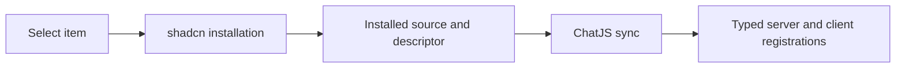

Start in a ChatJS app containing `chat.config.ts` and `components.json`.

```bash
npx @chat-js/cli@latest add word-count --yes
```

The CLI validates the item's ChatJS metadata and existing registration outputs.
shadcn installs the item, supporting registry files, and npm dependencies using
your project's package manager. ChatJS then reads local descriptors and generates
typed imports in `tools/chatjs/tools.ts` and `tools/chatjs/ui.ts`.



The app derives installed tool types through `lib/ai/installed-tools.ts` and
selects their renderers through `lib/ai/tool-renderer-registry.ts`.

## Customize and update

Edit installed `tool.ts` and `renderer.tsx` normally. Put additional registrations
in `custom-tools.ts` and `custom-ui.ts`. Leave generated indexes to `sync`.

Repeat `add` to update an item. Existing files use normal shadcn overwrite
behavior. Use `--overwrite` only when you want to replace installed source.

After a direct shadcn install, or a reported registration failure, run:

```bash
npx @chat-js/cli@latest sync
```

Sync validates descriptors, duplicate keys, and generated-index integrity before
writing registrations. A missing or mismatched requested descriptor is an error.

## Related

- [Tool Registry](../core/tool-registry) for ownership and migration
- [Tools](./tools) for building a registry item
- [CLI add](../cli/add) for command options
