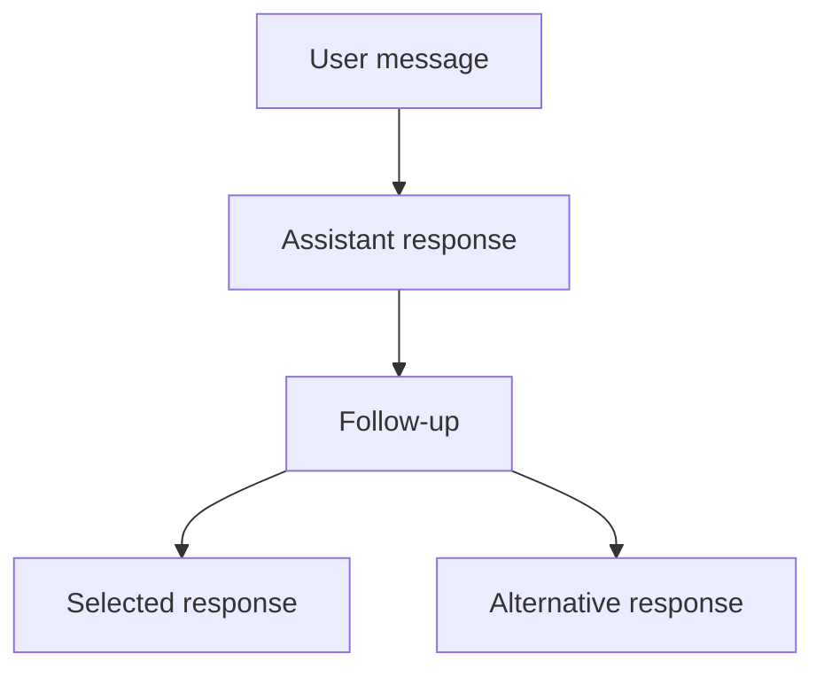

`useThread` is the React interface to the `Thread` controller behind branching
conversations in ChatJS. You keep the familiar AI SDK `useChat` interface for
the selected conversation, while every message and response branch lives in a
complete tree.

Use it when you need to edit earlier messages, compare alternative replies, or
move between branches while responses continue streaming.

## Install

```bash
bun add @chat-js/thread ai@^7.0.93 @ai-sdk/react@^4.0.96 react
```

You need Node.js 22 or later and AI SDK 7. The React adapter requires
`@ai-sdk/react ^4.0.96` and React 18 or later. The repository tests use React
19.2.3. AI SDK 6 applications must upgrade their SDK and provider packages
before using this version.

The headless `@chat-js/thread` entry point needs only `ai`. React applications
import the hook from `@chat-js/thread/react`.

For a compatible AI SDK application, replace the `useChat` import while keeping
your existing message list and composer:

```diff
- import { useChat } from "@ai-sdk/react";
+ import { useThread } from "@chat-js/thread/react";

- const chat = useChat({ transport });
+ const chat = useThread({ transport });
```

The top-level helpers remain compatible with `UseChatHelpers`, including
`messages`, `sendMessage`, `regenerate`, `stop`, `status`, tools, and approvals.

The hook manages client state. Your application still supplies the AI SDK
transport, server endpoint, authentication, storage and branch controls.
See the [existing-app recipe](../cookbook/threaded-chat) for a complete client
and server example.

## Mental model

`useThread` separates four concepts:

- **Tree:** every message and its parent-child relationship
- **Cursor:** the message currently selected by the application
- **Active path:** the root-to-cursor messages exposed as `chat.messages`
- **Run:** one assistant response with its own status, error, and stop control



Moving the cursor changes the active path. It does not delete descendants or
stop runs on other branches.

## Create a branch

Select any message and send normally. The new user message becomes a child of
the selected node.

```ts
chat.tree.setCursor(messageId);
await chat.sendMessage({ text: "Explore another approach" });
```

Editing is an application-level operation. Select the original user message's
parent, then send the replacement as a new message:

```ts
chat.tree.setCursorToParentOf(originalMessageId);
await chat.sendMessage({
  id: crypto.randomUUID(),
  role: "user",
  parts: [{ type: "text", text: editedText }],
});
```

See [Branching](../features/branching) for the ChatJS user experience.

## Run parallel responses

Each assistant response is an independent run. Start the first response with a
new user message, then start alternatives from that same user node:

```ts
const userMessageId = crypto.randomUUID();
const primary = await chat.tree.startRun({
  message: {
    id: userMessageId,
    role: "user",
    parts: [{ type: "text", text: "Give me three options" }],
  },
  follow: true,
});

const alternatives = await Promise.all([
  chat.tree.startRun({ from: userMessageId, follow: false }),
  chat.tree.startRun({ from: userMessageId, follow: false }),
]);

await Promise.all([
  primary.finished,
  ...alternatives.map((run) => run.finished),
]);
```

`follow: false` leaves the cursor unchanged. The sibling appears when the first
stream write arrives. ChatJS uses this model for multiple replies from the same
model and for comparisons across different models.

See [Parallel Responses](../features/parallel-responses) for the product flow.

## Status and controls

Top-level state describes the selected path:

```ts
chat.status;
chat.error;
await chat.stop();
```

Tree state describes all runs:

```ts
chat.tree.status;
chat.tree.activeRuns;
chat.tree.runs;

await chat.tree.stopRun(runId);
await chat.tree.stopAll();
```

Statuses use the AI SDK values `submitted`, `streaming`, `ready`, and `error`.

## Persist the tree

Save the complete tree instead of only the selected `chat.messages` path:

```ts
const snapshot = chat.tree.getSnapshot();
await saveThread(snapshot);
```

Restore it with `initialTree`:

```ts
import { DefaultChatTransport } from "ai";

const chat = useThread({
  initialTree: savedSnapshot,
  transport: new DefaultChatTransport({ api: "/api/chat" }),
});
```

The snapshot is `{ version: 1, cursorId, nodes }`. Runtime indexes, active
requests, and run adapters are not persisted.

Restoring the tree does not restart every response. `resume: true` or
`resumeStream()` reconnects the selected assistant through your transport's
reconnect endpoint. Active request objects and run IDs are not durable jobs.
Your server must retain a resumable stream and route it to the correct
conversation and assistant. `tree.resumeRun(runId)` addresses a run that still
exists in the live controller.

The hook owns its default controller for its component lifetime. To keep
responses running across component unmounts, retain a controller in your
application runtime and pass `useThread({ thread })`. Do not share a
server-side controller between users.

See the [package README](https://github.com/FranciscoMoretti/chat-js/tree/main/packages/thread)
for the external state contract and full interface.
