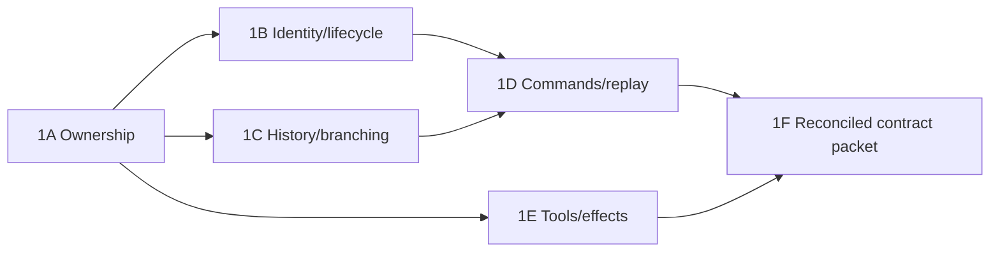

# Stage 1 — ownership and contracts

Detailed plan prepared 2026-09-08 for [the rough migration stages](stages.md). Status: proposed specification work; no runtime implementation or final architecture approval implied. Code references use the existing `5b6664e7` planning baseline and [current-app audit](current-app-audit.md).

## Outcome and scope

Stage 1 is complete when app, engine, tool and installation contributors can implement against the same small set of contracts without inventing competing meanings for a branch, execution, history revision or retry. It specifies required behavior and evidence; it does not claim Eve already supports that behavior.

Deliver one cohesive contract packet in this planning directory, with an ownership matrix, identity/relationship model, command/result semantics, execution/history lifecycle, typed tool/display contract, worked scenarios and a decision/proof register. Keep it Markdown initially. No production interfaces, schema migrations, generic engine abstraction, fork patches or test harness code are required to complete this stage. Introduce executable fixtures in the later proof/implementation work at the actual interface, not tests of invented pseudocode.

Settled constraints carried forward:

- Existing ChatJS app/framework is the product. Preserve its branch-capable behavior and merged composer/layout/gateway work.
- ChatJS owns ancestry and view selection; changing selection never starts or cancels execution.
- Canonical model history is server-resolved and server-only. Browser UI history is not authoritative input for inherited context.
- Divergent continuation uses an independent Eve session; a branch is a path, not necessarily a stored entity or permanent one-to-one session mapping.
- Prefer one canonical history authority and one durable workflow allocation per accepted create operation. Extra metadata/index rows are not competing transcripts, but their purpose must be explicit.
- Keep appropriate AI SDK types/tools/providers/feature APIs. Gateway, host, World, file storage and code sandbox remain independent selections.
- The approved fresh-conversation reset stands; legacy import and unrelated repair issues are not prerequisites.

## Work packages and order

| Work | Concrete deliverable | Depends on | Completion criterion |
| --- | --- | --- | --- |
| 1A. Vocabulary and ownership | Terms, relationship diagram, authority/mutation/read matrix | Existing audit | Every durable fact has one writer/authority; session, turn, app node and view are distinct |
| 1B. Identity and lifecycle | Identity scope, operation retry rules, admission/execution/projection states | 1A | Duplicate, conflict, unknown delivery and terminal outcomes are distinguishable |
| 1C. History and branching | Canonical revision/seed contract plus edit/regenerate/parallel/compaction examples | 1A; reconcile with 1B | Exact inherited prefix and eligibility can be specified without UI reconstruction or historical effects |
| 1D. Commands and view synchronization | Minimal caller interface, errors, replay/cursor/pending-input semantics | 1B + 1C | Caller can send, observe, reconcile, cancel and answer input without knowing storage internals |
| 1E. Typed tools and application effects | Tool context, rich display facts, renderer loading and domain-effect ownership | 1A; reconcile with 1C + 1D | Tool inference survives; model history and display data have explicit sources; replay cannot imply rerunning an effect |
| 1F. Integration and proof handoff | Existing-file migration map, acceptance scenarios and decision/proof register | 1A–1E | Every unresolved capability names its required proof; consumers know what is stable and what is provisional |

Develop 1B/1C/1E independently after 1A, then reconcile them before 1D/1F are declared complete. One editor owns the shared packet; reviews should challenge concrete scenarios rather than produce competing schemas. An eight-agent implementation wave is unnecessary for this specification stage.

## 1A. Vocabulary, relationships and authority

Use the following proposed distinctions in the packet; reuse current names where their meaning matches rather than renaming the app wholesale.

| Term | Meaning and relationship |
| --- | --- |
| Conversation | Application-owned collection of message ancestry and metadata under a trusted owner |
| Node | Stable application message identity with a parent relationship; tool parts do not automatically become tree nodes |
| Selected path | An ordered ancestry path, computed from nodes; several views can select different paths |
| View | A presentation selection/lifetime; it observes execution and is not an execution owner |
| Execution binding | Authorized mapping between application origin/response nodes and Eve session/turn identities |
| Eve session | Engine-owned linear execution context; independent from a conversation's full tree |
| Eve turn | Engine unit of work within a session; exact correspondence to app nodes must be documented, not assumed |
| Operation | Immutable owner-scoped command intent with a stable retry key; not a model name or a view identifier |
| Canonical revision | Opaque reference to exact committed model history/provenance; not an SSE offset or package version |
| Display projection | Authorized renderable facts and cursor derived from durable sources; no execution authority |
| Domain effect | Separately authoritative mutation such as a document revision, file object or credit charge |

Produce a matrix specifying writer, readers, allowed mutations and deletion/retention semantics for ancestry, binding, canonical revision, display facts, pending approval, title/project/share metadata, tool results, document revisions, attachments and charges. Source-backed rich display facts may need storage beyond canonical model messages; call those facts authoritative for display rather than pretending a lossy model transcript can recreate them.

Stress-test relationships: two views of one execution; two executions for the same model; one session spanning multiple linear turns; a source session later compacted after a sibling branch was created; a shared read-only conversation with no execution-control access.

## 1B. Identity, admission and lifecycle

Specify namespaces and validation, without prematurely choosing SQL tables:

- Owner identity comes from verified auth/anonymous session and includes a trusted identity namespace. Submitted owner fields are not authority.
- Conversation/node/session/turn/input identities must be checked together. A valid individual ID does not imply a valid cross-ID relationship.
- Each accepted create intent binds owner, selected prefix/revision, user input, model/tool policy and applicable configuration provenance. Server-normalized intent determines equality; define which volatile fields are excluded.
- An operation key may be retried with the same intent. Reuse with conflicting intent is rejected. Define key retention, expired-key response and behavior after account transition; avoid a dedupe TTL that silently allows duplicate creation.
- Distinguish unallocated valid intent, uncertain delivery, durably accepted canonical binding and rejected intent. A timeout cannot transition uncertain delivery back to safe-to-create.
- Admission and execution are separate: accepted does not mean running or completed. Define observable queued/running/waiting-input/cancel-requested/terminal outcomes as needed; map to actual Eve states during Stage 2 rather than inventing a second engine state machine.
- A command promise resolving is not necessarily durable success; account for previously observed callback-only errors.

Deliver a transition table: trigger, prior state, durable fact required, caller-visible result and retry/reconciliation action. Include crash before admission, after engine commit before app binding, after binding before response, cancel before binding and late completion after cancel request. Authorization must occur before in-process coalescing and on durable reconciliation/replay paths.

## 1C. Canonical history, branching and context policy

The resolver takes an authorized application path and returns an eligible exact engine revision/prefix or an explicit reason it cannot. It cannot silently fall back to UI text, last-five truncation or latest mutable document content.

Specify:

1. **History content:** role/order, tool call/result identity and structured output, provider metadata/options where applicable, file content references, rich-fact links, and captured instruction/configuration provenance. Separate what the model saw from what the UI displays.
2. **Commit eligibility:** an emitted completion event is insufficient. A revision must refer to actual durable engine state. Pending tools/approvals, failed and canceled turns need an explicit seedability policy based on their committed contents.
3. **Prefix semantics:** editing U2 seeds through A1, then supplies U2′; regenerating A1 seeds through U1 without delivering U1 twice. Document exactly where initializer history ends and the next command begins.
4. **Instruction semantics:** distinguish inherited historical instructions from current application/project policy. Recommend explicit policy provenance and applying current policy once at new execution; define whether a changed policy forces a new session. Stage 1 must resolve potential duplication and continuation inconsistencies.
5. **Compaction/retention:** retain the revision/provenance required by surviving branch points or return a defined unavailable-history error. Specify how display history remains readable independently. Full selected history plus explicit compaction is recommended; token thresholds/models/host limits are later policy tuning.
6. **Concurrent linear sends:** recommend serial admission per session with immutable parent/revision expectations. Reject or explicitly queue conflicting submissions; do not silently append both to a history different from the user's selected path. Parallel responses deliberately allocate independent executions.

Draw worked before/after examples for continue, edit, regenerate, duplicate-model parallel responses, clone/share, and branching from compacted history. No native tree manager, rewind API, suffix seed or pending-state cloning is required.

## 1D. Caller interface and synchronization

Describe a small ChatJS application interface around user intentions. Proposed responsibilities, not final method names or released Eve APIs:

| Intention | Caller supplies | Required result/behavior |
| --- | --- | --- |
| Submit | Conversation/parent, operation key, typed input, selected models/tools | Accepted canonical operation/binding or typed rejection/uncertainty; server chooses reuse/fresh session |
| Observe | Authorized conversation/execution and projection cursor | Initial snapshot plus ordered authorized updates; no canonical raw history |
| Resolve operation | Stable operation key under current trusted owner | Same durable result or explicit pending/unresolved/conflict; never blind replacement creation |
| Cancel | Original targeted execution and command identity | Acknowledged request, then observable terminal result; cooperative behavior stated |
| Respond to input | Original execution/turn/input identity and validated response | Idempotent acceptance or stale/conflict/denied; selection changes irrelevant |
| Select path | View and node | Local view change; zero engine mutation |

Separate authentication failure, inaccessible path, invalid input, intent conflict, unavailable history, pending reconciliation, stale approval and engine failure. Decide draft retention for each: invalid input is editable; valid uncertain input remains immutable until reconciled; a terminal failed response does not erase the user's draft/history.

Specify snapshot/cursor pairing, reconnect from missing/stale cursor, duplicate events and interrupted projection writes. If cursor expiry requires a fresh snapshot, say so. Never let an event cursor from one execution resume another. Include multi-tab observer behavior, mount/unmount, hidden runs, reload during approval and Stop→Send recovery. Read-only sharing exposes only permitted display projection.

Do not mirror every Eve internal command in the public ChatJS interface. Keep engine-specific retries, binding and history resolution inside the execution module. Do not create a generic multi-engine plug-in framework solely for this migration.

## 1E. Tools, frontend types and application effects

Preserve inference from the selected installed tool definitions to ChatMessage tool parts and frontend props. Enumerate model-facing input/output, rich frontend data, progress, errors and pending user input separately; do not use one untyped payload for all of them.

Tool execution receives trusted caller, execution/turn/tool-call identity, cancellation context and selected capability dependencies. Reconstruct process-local clients such as MCP clients at execution time; do not serialize them or credentials into workflow/display payloads. Define the lifecycle for streamed progress versus committed result facts.

For documents/files/credits and other external effects, specify a stable logical-effect identity, retry behavior, result/reference persistence and recovery after effect completion before workflow acknowledgment. Do not promise exactly-once external mutations without a capable service contract. Historical seed/replay consumes committed results without invoking the tool again.

For renderers, define selected-tool-to-loader registration, loading/error/unknown-tool fallback and server/client import separation. Existing artifact-editor laziness is not proof that paired tool renderers are lazy. Runtime loading must preserve compile-time pairing. Leave actual chunk tests to Stage 3 implementation.

Keep #332's installed Gateway and injected configuration contract intact. Define the compatible model/tool dependencies Eve receives without reintroducing a catalog-wide switch. Installation work consumes these contracts; host/World selection does not choose model gateway or code sandbox.

## 1F. Acceptance scenarios and handoff

Each scenario must have a specified expected outcome and an implementation-proof owner. These are specifications now, not passing test claims.

| Scenario | Contract verdict required |
| --- | --- |
| Two replicas retry identical create; response lost | Same accepted operation/session and preferred single allocated workflow |
| Same key, changed input or model | Conflict before new effects |
| Wrong owner joins an in-flight create or mixes IDs | Denied before coalescing/reconciliation; no leaked result |
| Edit/regenerate after completed tool and document mutation | Exact inherited prefix/revision; no repeated mutation or duplicated user input |
| Parent session advances/compacts while a sibling is selected | Resolver uses the selected committed revision, never latest session history implicitly |
| Two views; hidden run waits for approval | Views remain independent; response targets original pending input |
| Cancel one of two same-model responses | Other execution continues; cancel acknowledgment is not mistaken for terminal state |
| Reload after callback-only command failure | Preserve valid intent/draft and reconcile before retry |
| Projection commit interrupted or cursor expired | Rebuild/replay without skipped facts or repeated effects |
| Source file/document is shared by siblings | Deletion/retention cannot silently break a surviving branch's required references |
| Public share reader probes raw engine controls | Display access does not grant control/canonical-history access |
| Context exceeds configured limit | Explicit compaction/limit behavior and seed provenance; no silent path truncation |

Map agreed contracts to existing modules: app runtime/registry and chat-sync; thread ancestry/run host; server path resolver and chat routes; typed tool registration/renderers; auth/tRPC and domain stores; installed Gateway/CLI. This is a responsibility map, not authorization to edit all those files in one PR.

Produce a proof register with columns: requirement, currently available evidence, missing proof, owning stage, artifact/version under test and failure consequence. Stage 2 owns durable read/seed/admission/World/package proofs; Stage 3 owns typed UI/tool/installer implementation checks; Stage 4/5 own integrated browser/deployment/cutover acceptance.

## Decisions and exit gate

Resolve in Stage 1:

- Exact mapping/cardinality of application nodes to engine sessions/turns and canonical prefix checkpoints.
- Instruction/configuration provenance, same-session reuse eligibility and concurrent send behavior.
- Source of durable rich display facts, projection/cursor recovery and retention semantics.
- Error/uncertainty/draft semantics and effect identity rules.
- Whether full-history plus explicit compaction is the accepted target context policy.

Carry into Stage 2 as explicit proof questions: reader versus committed feed, strict admission feasibility, artifact build/export compatibility and selected World operational limits. Do not block the contract packet on choosing final patch files, DB indexes or a published upstream release. Maintenance commitment and any weaker creation guarantee require the resulting evidence before adoption.

Exit checklist:

- [ ] One internally consistent packet covers 1A–1F, with settled constraints distinguished from proposals.
- [ ] Every authoritative fact, command, identity and state has a defined owner and failure behavior.
- [ ] Worked branch/retry/approval/effect scenarios have unambiguous expected results.
- [ ] No raw browser history authority, accidental duplicate execution owner or fictitious supported Eve API is introduced.
- [ ] Stage 2 and Stage 3 can take bounded work from the packet, with unresolved proofs explicitly listed.
- [ ] Material proposed behavior changes are reviewed before the packet is treated as accepted implementation specification.

Next session order: work through 1A ownership/cardinality, then the U1/A1/U2 branching example to settle 1B/1C. Use that concrete flow to derive the caller interface, rather than starting with a large set of TypeScript abstractions.
