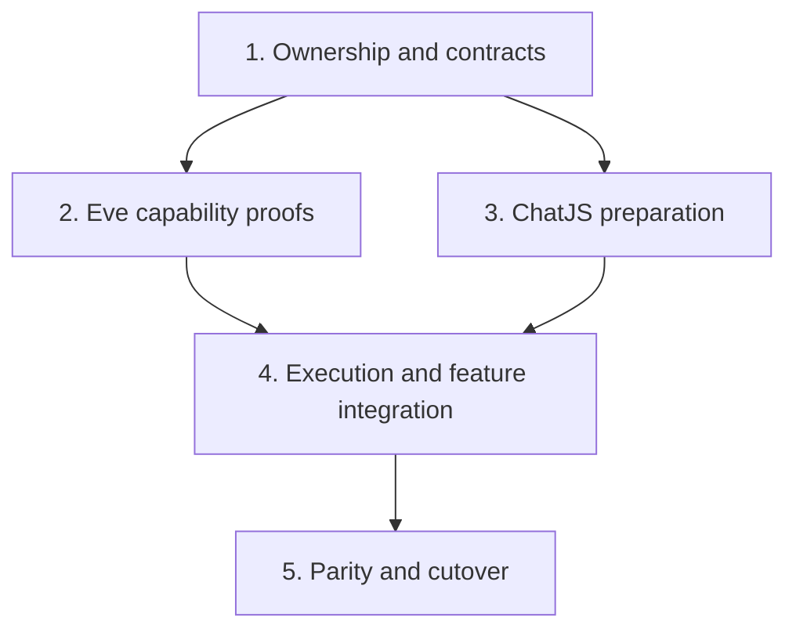

# Rough migration stages and decisions

Saved from the planning discussion on 2026-09-08. This is the navigation map for the [full migration plan](README.md), not a second implementation specification. Current focus: [Stage 1 in detail](stage-1-contracts.md).

## Stages

1. **Ownership and contracts:** define ChatJS tree/view/application authority, Eve execution/history authority, identities, command semantics and typed tool/display contracts. Produce a reviewable specification before engine changes.
2. **Eve capability proofs:** committed history, fresh seed, recoverable keyed admission, memory capture, World uniqueness, packaging and operational recovery. Prove against real selected artifacts; compare bounded fixes with upstream releases.
3. **ChatJS preparation:** separate tree/view/execution concerns; adapt typed tools and lazy frontend pairing; prepare auth, domain services and selected installation contracts. This can overlap Stage 2 after the relevant Stage 1 contracts settle.
4. **Execution and feature integration:** connect the existing app to Eve; integrate continuation, branching, parallel runs, replay, cancellation, approvals, tools and application services.
5. **Parity and cutover:** full app/browser/install/deployment acceptance, crash and restore rehearsal, fresh conversation store, then default switch and retirement of obsolete execution code.

A linear experiment is not a replacement for the branch-capable existing app. Stage 3 preparation does not establish that Stage 2 contracts work. No stage requires a new standalone Eve example or legacy conversation import.

## Gaps and decisions

| Subject | Gap or choice | Recommended direction / when decided |
| --- | --- | --- |
| Committed history | A transient completed event is not a durable seedable revision | Define server-only semantics in Stage 1; prove reader/feed in Stage 2 |
| Fresh seed | Independent session must preserve structured inherited history without rerunning tools | Full-history initialization; define contract in Stage 1, prove in Stage 2 |
| Creation | Unknown delivery must not cause duplicate workflows | Preserve preferred one-record guarantee; weaker canonical-owner alternative only after Stage 2 evidence |
| Memory capture | Recorded successful turns omitted documented callback | Isolated fix and candidate upstream report; independent of canonical-history contract |
| Postgres uniqueness | Recorded concurrent token claims admitted multiple owners | Existing upstream fix direction plus real DB/schema compatibility proof |
| Maintenance | Released APIs, small patches, maintained source delta or upstream-only | Prefer bounded deltas if necessary; accept maintenance commitment after packing/scope proof |
| First deployment | Host, World and model gateway are separate choices | Node24/Postgres first proof candidate; preserve installed gateway selection |
| Context policy | Current app truncates to five messages | Recommend full selected history plus explicit compaction policy; Stage 1 defines semantics, later evidence determines limits |
| Reports | New defects versus existing feature/bug discussions | Review prepared drafts, reproduce/deduplicate before separately authorized upstream submission |
| Data reset | Legacy conversations versus unrelated account data | Fresh conversations already accepted; explicitly inventory account/balance/connector retention before cutover |

Detailed evidence and report drafts remain in the linked full-plan documents. Their dated source/release observations are not a fresh upstream status check on 2026-09-08.
